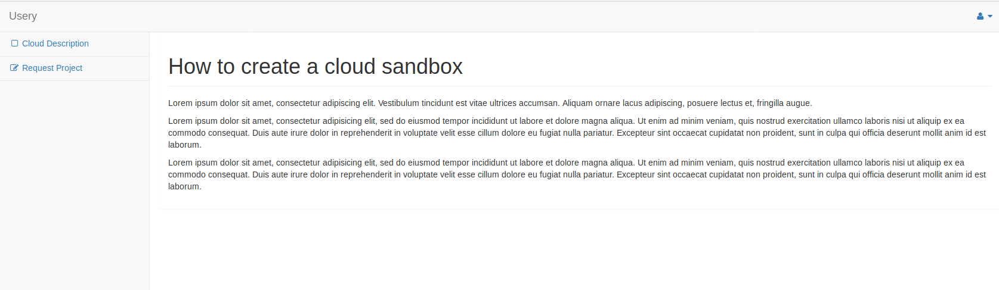
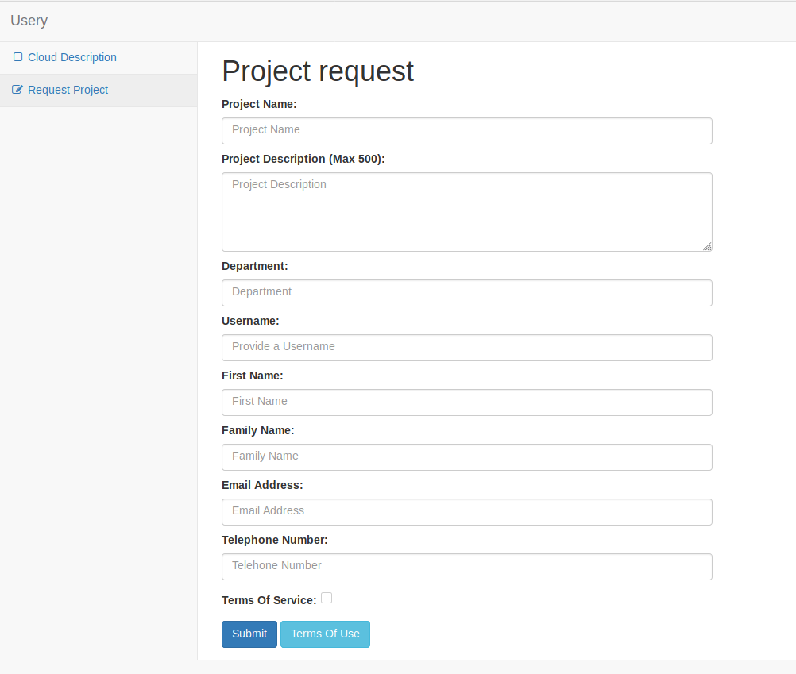
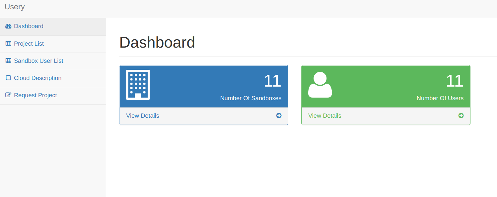
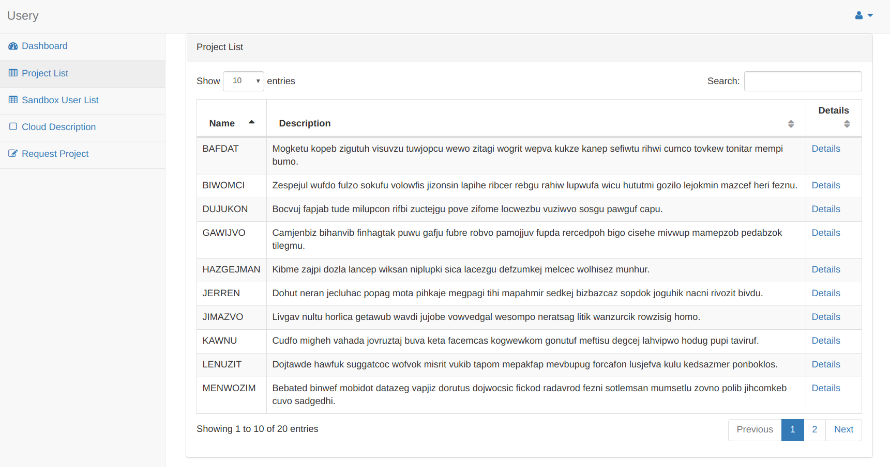
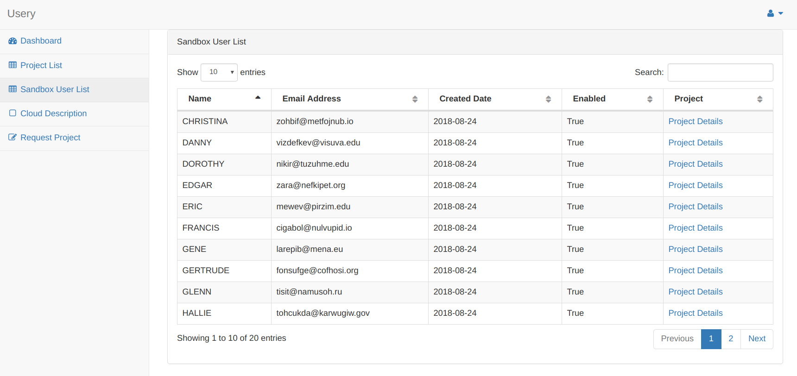
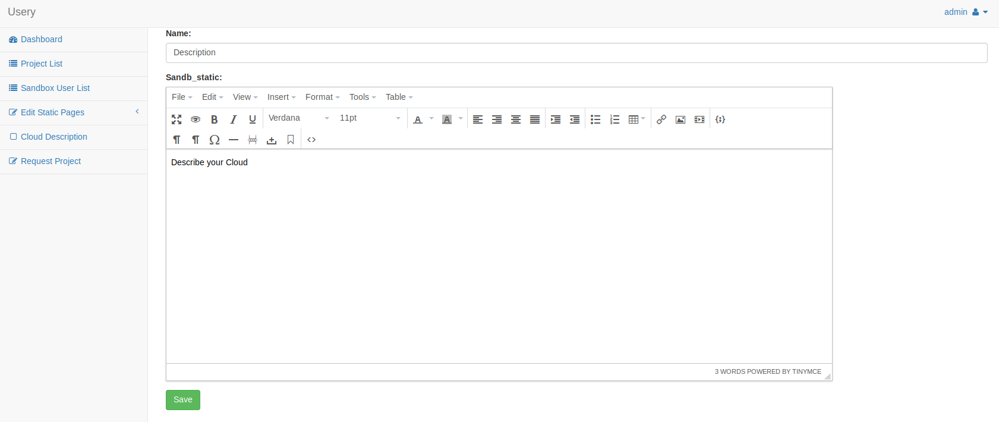

<h1 align=center>

</h1>

# Usery Portal for Cloud Sandboxes
### This is Beta software at the moment
Usery is a portal to allow users to create themselves an openstack sandbox cloud project with no need for the cloud admins to do anything.
It will setup a project in the the cloud, create the user necessary for accessing this project and then email the user the login details.
It will also email the cloud support team to let them know of the new sandbox that has been created.

The portal needs a postgresql database to store the static file customization the Openstack metadata about the users and projects is stored within the object metadata.

## Integrations
[](https://dependabot.com)

## Getting Started

These instructions will get you a copy of the project up and running on your local machine for development and testing purposes.

### Prerequisites

What things you need to install and how to install them.

Postgresql 9.6 running with a user and database configured.
I use a docker container for this purpose.

For developemnt you will need a working openstack install that you can connect to.
I use this repository https://github.com/joestack/devstack-queens from my friend @joestack to spin up my test environment.

You need a python 3.6.5 or later environment.

These packages are used
[requirements.txt](requirements.txt)

### Installing

A step by step series of examples that tell you how to get a development env running

*  Clone this repository to your development area
```
git clone git@github.com:lhaig/usery.git
```
* Install the prerequisites for running the server
```
pip install -r requirements.txt
```
### Openstack clusters with only default domain (Not Recommended for production)
* Create an Openstack user that will be the Sandbox admin
  * login to Openstack Horizon
  * Create am Sandbox admin user
  * Grant the Sandbox admin user the admin role to the admin project.

* Create and edit your .env file
  * Add the user details for the sandbox admin user
```
cp .env.example .env
```
* Make sure you create a unique SECRET_KEY and add it to the file
```
python manage.py shell -c 'from django.core.management import utils; print(utils.get_random_secret_key())'
```
The .env.example should work out of the box with the openstack install mentioned above just add the SECRET_KEY created in the last step.

*  Run the database migrations.
```
| => ./manage.py migrate
Operations to perform:
  Apply all migrations: admin, auth, contenttypes, portal, sessions
Running migrations:
  Applying contenttypes.0001_initial... OK
  Applying auth.0001_initial... OK
  Applying admin.0001_initial... OK
  Applying admin.0002_logentry_remove_auto_add... OK
  Applying admin.0003_logentry_add_action_flag_choices... OK
  Applying contenttypes.0002_remove_content_type_name... OK
  Applying auth.0002_alter_permission_name_max_length... OK
  Applying auth.0003_alter_user_email_max_length... OK
  Applying auth.0004_alter_user_username_opts... OK
  Applying auth.0005_alter_user_last_login_null... OK
  Applying auth.0006_require_contenttypes_0002... OK
  Applying auth.0007_alter_validators_add_error_messages... OK
  Applying auth.0008_alter_user_username_max_length... OK
  Applying auth.0009_alter_user_last_name_max_length... OK
  Applying portal.0001_initial... OK
  Applying sessions.0001_initial... OK
```

*  Create your super admin user
```
| => ./manage.py createsuperuser
Username (leave blank to use 'dev_user'): superadmin
Email address: superadmin@example.com
Password:
Password (again):
Superuser created successfully.
```

* Create the default static files

```
| => ./manage.py load_defaults
Starting Portal Default Data script...

```

* Run the server

```
| => ./manage.py runserver
Performing system checks...

System check identified no issues (0 silenced).
August 20, 2018 - 17:58:42
Django version 2.1, using settings 'usery.settings.development'
Starting development server at http://127.0.0.1:8000/
Quit the server with CONTROL-C.
```

* You should now be able to browse to http://127.0.0.1:8000/ and create a project.
As this is a development environment the email is not sent to a server but printed to the django console

### Cron jobs for disabling and deleting projects

In the .env file add your desired expiry in days the default is Disable after 30 days and then delete 30 days later

To configure the cron job use this example

```
# m h  dom mon dow   command
0 4 * * * /bin/python3 /srv/usery/usery/manage.py disable_sandboxes
0 5 * * * /bin/python3 /srv/usery/usery/manage.py delete_sandboxes
```


## Development

* To load some test data in the openstack cloud run
```
| => ./manage.py load_fixtures
```

* To delete the fixtures you created above
```
| => ./manage.py delete_fixtures
```

## Running the tests

The project has some tests but it is not completely covered as yet.
To run the tests that are there do the following
```
| => ./manage.py test
Creating test database for alias 'default'...
System check identified no issues (0 silenced).
.....................................
----------------------------------------------------------------------
Ran 37 tests in 3.802s

OK
Destroying test database for alias 'default'...

```

### A bit about the project tests

The main two project directories are
* Portal
* Accounts

Each one of these has a test directory with tests inside.
When you add code please make sure you create a test for it as well.
The Openstack sections are not tested at the moment due to the need to have a running install of Openstack

## Built With

* [Django](https://www.djangoproject.com/) - The web framework used
* [Bootstrap](https://getbootstrap.com/)
* [SB Admin 2 Template](https://startbootstrap.com/template-overviews/sb-admin-2/)

## Contributing

Please read [CONTRIBUTING.md](./CONTRIBUTING.md) for details on our code of conduct, and the process for submitting pull requests to us.

## Versioning

We use [SemVer](http://semver.org/) for versioning. For the versions available, see the [tags on this repository](https://github.com/lhaig/usery/tags).

## Authors

* **Lance Haig** - *Initial work* - [lhaig](https://github.com/lhaig)

See also the list of [contributors](https://github.com/lhaig/usery/contributors) who participated in this project.

## License

This project is licensed under the GPLv3 License - see the [LICENSE](./LICENSE) file for details

## Acknowledgments

* [Openstack developers](https://www.openstack.org/)
* [Vitor Freitas](https://simpleisbetterthancomplex.com)
* [JoeStack](https://github.com/joestack/)

## Screenshots

### Home Page

### Request Project

### Admin Dashboard

### Admin Project List

### Admin Sandbox User List

### Admin Static Page List

### Admin Static Page Edit

